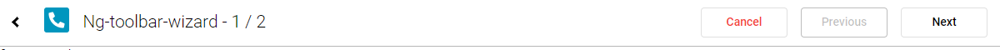
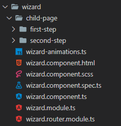
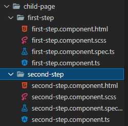

# NgToolbarWizard

NgToolbarWizard is used to facilitate the creation of wizards, using navigation through the Angular router.

At the passage of each step, a custom validation of the page is made, and it is possible to perform more actions than the simple passage of steps, using the page data.



## Getting Started

We take into consideration that the structure is on two levels.
- The wizard page
  - The sub pages



In the Wizard page we have to import the NgToolbarWizardModule module. Once this is done, you can use our component.

```HTML
<ng-toolbar-wizard 
    [advanceSearchStep]="advanceSearchStep"
    imgPath="assets/icon/Img.svg"

    title="Ng-toolbar-wizard"
    textPrev="Previous"
    textNext="Next"
    confirmNext="confirm"
    textCancel="Cancel"

    (onCompleteWizardEvent)="completeEvent()"
    (onCancelEvent)="cancelEvent()"
    (onBackEvent)="backEvent()">
</ng-toolbar-wizard>
```

advanceSearchStep is a StepPage [] that defines:
- the step of the pages;
- The Path of the component to be loaded;
- A method to perform additional actions in the next step (optional);
- A method to perform additional actions on the return of the previous step (optional).

```ts
advanceSearchStep: StepPage[] = [
    {
      step: 1,
      pagePath: 'wizard/first-step',
      // eslint-disable-next-line @typescript-eslint/no-unused-vars
      nextStep: (val: any) => {
        console.log('first-step next');
      },
    },
    {
      step: 2,
      pagePath: 'wizard/second-step',
      // eslint-disable-next-line @typescript-eslint/no-unused-vars
      nextStep: (val: any) => {
        console.log('second-step next');
      },
      prevStep: (val: any) => {
        console.log('prev-step next');
      }
    },
  ];
```

NextStep and prevStep have as input a parameter which is a custom object deriving from the child pages.

## Child Page



Le pagine figlio devono implementare ISubPage, interfaccia esposta dalla libreria la quale obbliga ad implementare due metodi:
- getValue(): metodo che ritorna un oggetto di qualsiasi tipo il quale viene intercettato dal metodo nextStep e prevStep spiegati prima;
- isValidForm(): metodo che serve per la validazione della pagina, richiamato al click del nextStep

```ts
@Component({
  selector: 'app-first-step',
  templateUrl: './first-step.component.html',
  styleUrls: ['./first-step.component.scss']
})
export class FirstStepComponent implements ISubPage {
  getValue(): any {
    return undefined;
  }

  *isValidForm(): IterableIterator<string> {
    if(true)  
      yield 'prova';
      
    if(true)
      yield 'msg';
  }
}
```

The last step is to correctly set up the router.module of the wizard.

```ts
const routes: Routes = [
    {
        path: '',
        component: WizardComponent,
        runGuardsAndResolvers: 'always',
        children: [
            { path: '', redirectTo: 'first-step'},
            {
              path: 'first-step',
              component: FirstStepComponent
            },
            {
                path: 'second-step',
                component: SecondStepComponent
            },
          ],
    }
];

@NgModule({
    imports: [
        RouterModule.forChild(routes)
    ],
    exports: [
        RouterModule
    ]
})
export class WizardRoutingModule { }
```

Potete trovare un esempio di implementazione a questo link: https://github.com/DenMic/ng-toolbar-wizard